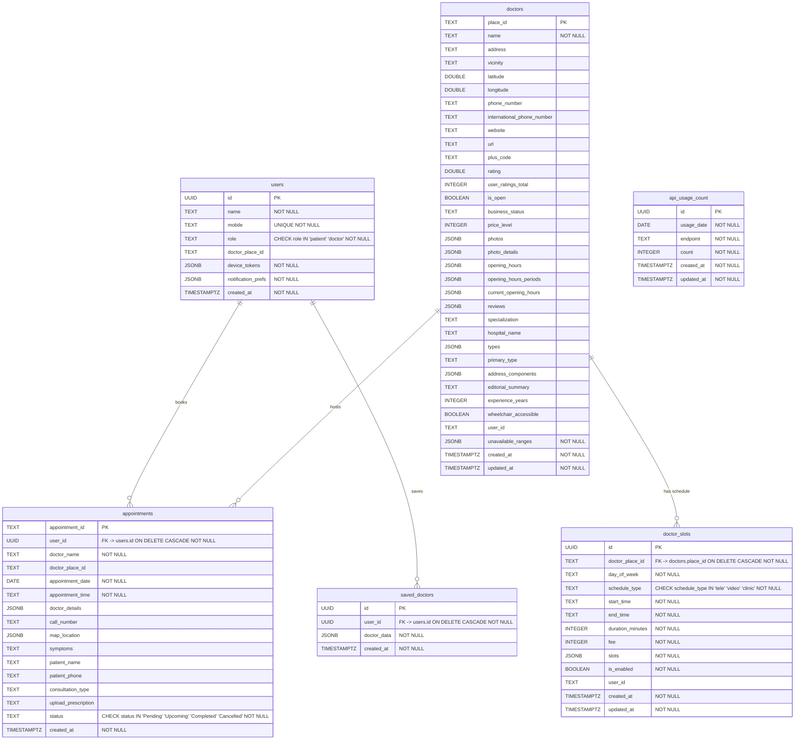

# DrsListing — Database Schema

Auto-generated from `supabase/migrations/20260807000001_full_schema_all_fields.sql` (the consolidated full-schema migration). Regenerate with `python supabase/gen_schema_docs.py`.

## Overview

Six tables. Users log in by mobile number (no OTP); identity is a locally-stored UUID and RLS is scoped to custom request headers (`x-user-mobile` / `x-user-id`). The QR booking-page Edge Function writes with the service role key (bypasses RLS). Two server-side triggers enforce booking rules: a slot stays occupied until the appointment is **Cancelled**, and appointments are blocked on dates the doctor marked unavailable.

## ER Diagram

## Tables

### `users`

| Column | Type | Nullable | Default | Constraints |
|--------|------|----------|---------|-------------|
| `id` | `UUID` | NO | `gen_random_uuid()` | PRIMARY KEY |
| `name` | `TEXT` | NO | `—` | — |
| `mobile` | `TEXT` | NO | `—` | UNIQUE |
| `role` | `TEXT` | NO | `'patient'` | CHECK (role IN ('patient', 'doctor')) |
| `doctor_place_id` | `TEXT` | YES | `—` | — |
| `device_tokens` | `JSONB` | NO | `'[]'::jsonb` | — |
| `notification_prefs` | `JSONB` | NO | `'{"appointment_booked": true, "appointment_cancelled": true, "appointment_status_changed": true, "all": true}'::jsonb` | — |
| `created_at` | `TIMESTAMPTZ` | NO | `NOW()` | — |

**Indexes:** `idx_users_mobile`, `idx_users_doctor_place_id`

### `appointments`

| Column | Type | Nullable | Default | Constraints |
|--------|------|----------|---------|-------------|
| `appointment_id` | `TEXT` | NO | `—` | PRIMARY KEY |
| `user_id` | `UUID` | NO | `—` | FK → users.id (ON DELETE CASCADE) |
| `doctor_name` | `TEXT` | NO | `—` | — |
| `doctor_place_id` | `TEXT` | YES | `—` | — |
| `appointment_date` | `DATE` | NO | `—` | — |
| `appointment_time` | `TEXT` | NO | `—` | — |
| `doctor_details` | `JSONB` | YES | `'{}'::jsonb` | — |
| `call_number` | `TEXT` | YES | `—` | — |
| `map_location` | `JSONB` | YES | `'{}'::jsonb` | — |
| `symptoms` | `TEXT` | YES | `—` | — |
| `patient_name` | `TEXT` | YES | `—` | — |
| `patient_phone` | `TEXT` | YES | `—` | — |
| `consultation_type` | `TEXT` | YES | `—` | — |
| `upload_prescription` | `TEXT[]` | YES | `'{}'` | — |
| `status` | `TEXT` | NO | `'Upcoming'` | CHECK (status IN ('Pending', 'Upcoming', 'Completed', 'Cancelled')) |
| `created_at` | `TIMESTAMPTZ` | NO | `NOW()` | — |

**Indexes:** `idx_appointments_user_id`, `idx_appointments_status`, `idx_appointments_date`, `idx_appointments_user_status`, `idx_appointments_doctor_place_id`, `idx_appointments_slot_occupancy`

### `saved_doctors`

| Column | Type | Nullable | Default | Constraints |
|--------|------|----------|---------|-------------|
| `id` | `UUID` | NO | `gen_random_uuid()` | PRIMARY KEY |
| `user_id` | `UUID` | NO | `—` | FK → users.id (ON DELETE CASCADE) |
| `doctor_data` | `JSONB` | NO | `'{}'::jsonb` | — |
| `created_at` | `TIMESTAMPTZ` | NO | `NOW()` | — |

**Indexes:** `idx_saved_doctors_user_id`, `idx_saved_doctors_place_id`

### `doctors`

| Column | Type | Nullable | Default | Constraints |
|--------|------|----------|---------|-------------|
| `place_id` | `TEXT` | NO | `—` | PRIMARY KEY |
| `name` | `TEXT` | NO | `—` | — |
| `address` | `TEXT` | YES | `—` | — |
| `vicinity` | `TEXT` | YES | `—` | — |
| `latitude` | `DOUBLE PRECISION` | YES | `—` | — |
| `longitude` | `DOUBLE PRECISION` | YES | `—` | — |
| `phone_number` | `TEXT` | YES | `—` | — |
| `international_phone_number` | `TEXT` | YES | `—` | — |
| `website` | `TEXT` | YES | `—` | — |
| `url` | `TEXT` | YES | `—` | — |
| `plus_code` | `TEXT` | YES | `—` | — |
| `rating` | `DOUBLE PRECISION` | YES | `—` | — |
| `user_ratings_total` | `INTEGER` | YES | `—` | — |
| `is_open` | `BOOLEAN` | YES | `—` | — |
| `business_status` | `TEXT` | YES | `—` | — |
| `price_level` | `INTEGER` | YES | `—` | — |
| `photos` | `JSONB` | YES | `'[]'::jsonb` | — |
| `photo_details` | `JSONB` | YES | `'[]'::jsonb` | — |
| `opening_hours` | `JSONB` | YES | `'[]'::jsonb` | — |
| `opening_hours_periods` | `JSONB` | YES | `'[]'::jsonb` | — |
| `current_opening_hours` | `JSONB` | YES | `'{}'::jsonb` | — |
| `reviews` | `JSONB` | YES | `'[]'::jsonb` | — |
| `specialization` | `TEXT` | YES | `—` | — |
| `hospital_name` | `TEXT` | YES | `—` | — |
| `types` | `JSONB` | YES | `'[]'::jsonb` | — |
| `primary_type` | `TEXT` | YES | `—` | — |
| `address_components` | `JSONB` | YES | `'[]'::jsonb` | — |
| `editorial_summary` | `TEXT` | YES | `—` | — |
| `experience_years` | `INTEGER` | YES | `—` | — |
| `wheelchair_accessible` | `BOOLEAN` | YES | `—` | — |
| `user_id` | `TEXT` | YES | `—` | — |
| `unavailable_ranges` | `JSONB` | NO | `'[]'::jsonb` | — |
| `created_at` | `TIMESTAMPTZ` | NO | `NOW()` | — |
| `updated_at` | `TIMESTAMPTZ` | NO | `NOW()` | — |

**Indexes:** `idx_doctors_name`, `idx_doctors_specialization`, `idx_doctors_rating`, `idx_doctors_user_id`, `idx_doctors_primary_type`

### `doctor_slots`

| Column | Type | Nullable | Default | Constraints |
|--------|------|----------|---------|-------------|
| `id` | `UUID` | NO | `gen_random_uuid()` | PRIMARY KEY |
| `doctor_place_id` | `TEXT` | NO | `—` | FK → doctors.place_id (ON DELETE CASCADE) |
| `day_of_week` | `TEXT` | NO | `—` | — |
| `schedule_type` | `TEXT` | NO | `—` | CHECK (schedule_type IN ('tele', 'video', 'clinic')) |
|  | *schedule_type: tele = phone consultation, video = video call, clinic = in-person* | | | |
| `start_time` | `TEXT` | NO | `—` | — |
|  | *HH:MM format (24h)* | | | |
| `end_time` | `TEXT` | NO | `—` | — |
|  | *HH:MM format (24h)* | | | |
| `duration_minutes` | `INTEGER` | NO | `30` | — |
| `fee` | `INTEGER` | NO | `0` | — |
| `slots` | `JSONB` | NO | `'[]'::jsonb` | — |
| `is_enabled` | `BOOLEAN` | NO | `true` | — |
| `user_id` | `TEXT` | YES | `—` | — |
| `created_at` | `TIMESTAMPTZ` | NO | `NOW()` | — |
| `updated_at` | `TIMESTAMPTZ` | NO | `NOW()` | — |

- Composite constraint: `doctor_slots_unique_key`

**Indexes:** `idx_doctor_slots_doctor`, `idx_doctor_slots_day`, `idx_doctor_slots_user_id`

### `api_usage_count`

| Column | Type | Nullable | Default | Constraints |
|--------|------|----------|---------|-------------|
| `id` | `UUID` | NO | `gen_random_uuid()` | PRIMARY KEY |
| `usage_date` | `DATE` | NO | `CURRENT_DATE` | — |
| `endpoint` | `TEXT` | NO | `—` | — |
| `count` | `INTEGER` | NO | `0` | — |
| `created_at` | `TIMESTAMPTZ` | NO | `NOW()` | — |
| `updated_at` | `TIMESTAMPTZ` | NO | `NOW()` | — |

- Composite constraint: `api_usage_count_unique_day_endpoint UNIQUE (usage_date, endpoint)`

**Indexes:** `idx_api_usage_count_date`

## Row Level Security Policies

| Policy | Table |
|--------|-------|
| `users_select_own_row` | `users` |
| `users_insert_own_row` | `users` |
| `users_update_own_row` | `users` |
| `notifications_select_own` | `notifications` |
| `notifications_update_own` | `notifications` |
| `anon_can_select_appointments` | `appointments` |
| `anon_can_insert_appointments` | `appointments` |
| `anon_can_update_appointments` | `appointments` |
| `anon_can_select_saved_doctors` | `saved_doctors` |
| `anon_can_insert_saved_doctors` | `saved_doctors` |
| `anon_can_delete_saved_doctors` | `saved_doctors` |
| `anon_can_select_doctors` | `doctors` |
| `anon_can_insert_doctors` | `doctors` |
| `anon_can_update_doctors` | `doctors` |
| `anon_can_select_doctor_slots` | `doctor_slots` |
| `anon_can_insert_doctor_slots` | `doctor_slots` |
| `anon_can_update_doctor_slots` | `doctor_slots` |
| `anon_can_delete_doctor_slots` | `doctor_slots` |
| `anon_can_select_api_usage_count` | `api_usage_count` |
| `prescriptions_anon_upload` | `objects` |
| `prescriptions_anon_read` | `objects` |
| `prescriptions_anon_update` | `objects` |

## Functions

| Function | Signature |
|----------|-----------|
| `add_device_token` | `(p_token    TEXT,
    p_platform TEXT DEFAULT 'android')` |
| `remove_device_token` | `(p_token TEXT)` |
| `prune_old_notifications` | `(p_days integer DEFAULT 90)` |
| `update_updated_at_column` | `()` |
| `generate_appointment_id` | `()` |
| `get_appointment_counts` | `(p_user_id UUID)` |
| `increment_api_usage` | `(p_endpoint TEXT)` |
| `enforce_slot_booking_rule` | `()` |
| `enforce_unavailability_rule` | `()` |

## Triggers

| Trigger | Event | Table |
|---------|-------|-------|
| `set_doctors_updated_at` | UPDATE | `doctors` |
| `set_doctor_slots_updated_at` | UPDATE | `doctor_slots` |
| `trg_appointments_enforce_slot_rule` | INSERT OR UPDATE OF | `appointments` |
| `trg_appointments_enforce_unavailability` | INSERT OR UPDATE OF | `appointments` |

## Storage

| Bucket | ID | Public | Policies |
|--------|----|--------|----------|
| `prescriptions` | `prescriptions` | true | `prescriptions_anon_upload`, `prescriptions_anon_read`, `prescriptions_anon_update` |
